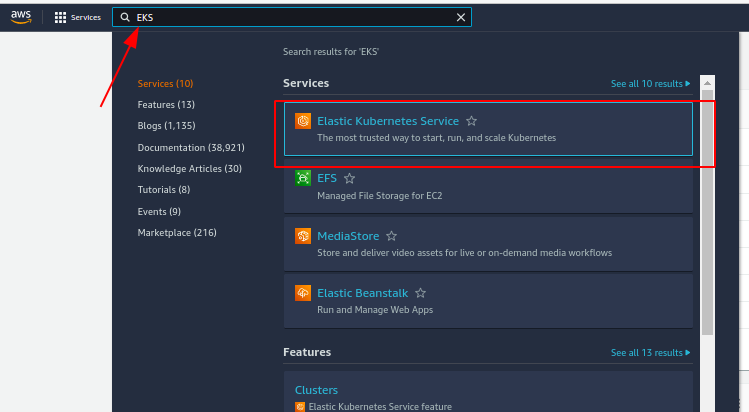

# Chaos-Engineering-using-LitmusChaos-on-Amazon-EKS

Chaos Engineering is the practice of experimenting on a system in order to build reliability and confidence in the system’s capability to withstand turbulent conditions in production.  It relies on concepts from chaos theory, which focus on the nonlinear and the unpredictable situations. The objective of chaos engineering is to identify weakness in a system through controlled experiments that introduce random and unpredictable behavior.

How does chaos engineering work?
Chaos engineering starts with understanding the software’s expected behavior.
    1. Hypothesis. Engineers ask themselves what should happen if they change a variable. If they terminate services at random, they assume the service will continue uninterrupted. The question and the assumption form a hypothesis.
    2. Testing. To test the hypothesis, chaos engineers orchestrate simulated uncertainty combined with load testing and watch for signs of upheaval in the services, infrastructure, networks, and devices that deliver the application. Any failures in the stack break the hypothesis.
    3. Blast radius. By isolating and studying failures, engineers can understand what happens under unstable cloud conditions. Any damage or influence caused by the test is known as the ‘blast radius.’ Chaos engineers can manage the blast radius by controlling the tests.
    4. Insights. The discoveries form inputs into the software development and delivery process, so new software and microservices will better stand up to unforeseeable events.
To mitigate damage to production environments, chaos engineers start in a non-production environment, then slowly extend to production in a controlled way. Once established, chaos engineering becomes an effective way to fine tune service-level indicators and objectives, improve alerting, and build more efficient dashboards, so you know you are collecting all the data you need to accurately observe and analyze your environment.
Who uses chaos engineering?
Chaos engineering generally originates from small teams within DevOps, often involving applications running in both pre-production and production environments. Because it can touch many systems, chaos engineering can have broad implications, affecting groups and stakeholders across the organization.
A disruption spanning hardware, networks, and cloud infrastructure can require input and participation from network and infrastructure architects, risk experts, security teams, and even procurement officers. That’s a good thing. The greater the scope of the test, the more useful chaos engineering becomes.
Athough a small team generally owns and manages the chaos engineering effort, it’s a practice that often requires input from—and provides benefits to—the village.
The benefits of chaos testing
The insights you can gain by testing the limits of your applications deliver a lot of benefits for your development teams and your overall business. Here are just a few benefits of a healthy, well-managed chaos engineering practice.
    • Increases resiliency and reliability. Chaos testing enriches the organization’s intelligence about how software performs under stress and how to make it more resilient.
    • Accelerates innovation. Intelligence from chaos testing funnels back to developers who can implement design changes that make software more durable and improve production quality.
    • Advances collaboration. Developers aren’t the only group to see advantages. The insights chaos engineers glean from their experiments elevate the expertise of the technical group, leading to response times and better collaboration.
    • Speeds incident response. By learning what failure scenarios are possible, these teams can speed troubleshooting, repairs, and incident response.
    • Improves customer satisfaction. Increased resilience and faster response times mean less down-time. Greater innovation and collaboration from development and SRE teams mean better software that meets new customer demands quickly with efficiency and high performance.
    • Boosts business outcomes. Chaos testing can also extend an organization’s competitive advantage through faster time-to-value, saving time, money, and resources, and producing a better bottom line.
The more resilient an organization’s software is, the more consumers and business customers can enjoy its services without distraction or disappointment.

## LitmusChaos Architecture
LitmusChaos is a cloud-native Chaos Engineering framework for Kubernetes. It is built using the Kubernetes Operator framework. A Kubernetes Operator is a software extension to Kubernetes that makes use of custom resource definitions (CRDs) to manage applications and their components.
The Litmus Chaos Operator helps reconcile the state of ChaosEngine, a custom resource that holds the chaos intent specified by a developer or DevOps engineer against a particular stateless/stateful Kubernetes deployment. The operator performs specific actions upon creation of the ChaosEngine, its primary resource. The operator also defines a secondary resource (the engine runner pod), which is created and managed by it in order to implement the reconcile functions.
Litmus takes a cloud-native approach to create, manage, and monitor chaos. Chaos is orchestrated using the following Kubernetes CRDs:
    • ChaosEngine: A resource to link a Kubernetes application or Kubernetes node to a ChaosExperiment. ChaosEngine is watched by the Litmus ChaosOperator, which then invokes ChaosExperiments
    • ChaosExperiment: A resource to group the configuration parameters of a chaos experiment. ChaosExperiment CRs are created by the operator when experiments are invoked by ChaosEngine.
    • ChaosResult: A resource to hold the results of a ChaosExperiment.

## LitmusChaos Architecture Summary 

The Litmus architecture can be segregated into two parts:

- Control Plane: Contains the components required for the functioning of Chaos Center, the website-based portal for Litmus.

- Execution Plane: Contains the components required for the injection of chaos in the target resources.

Chaos Center can be used for creating, scheduling, and monitoring Chaos Workflows, a set of chaos experiments defined in a definitive sequence to achieve desired chaos impact on the target resources upon execution. Users can log in to the Chaos Center using valid login credentials and leverage the interactive web UI to define their chaos workflow to target multiple aspects of their infrastructure. Once the user creates a Chaos Workflow using the Chaos Center, it is passed on to the Execution Plane. The Execution Plane can be present either in the host cluster containing the Control Plane if the self agent is being used, or in the target cluster if an external agent is being used. The Execution Plane interprets the Chaos Workflow as a list of steps required for injecting chaos into the target resources. It ensures efficient orchestration of chaos in cloud-native environments using various Kubernetes CRs. Once the Chaos Workflow is executed, Execution Plane sends the chaos result to the Control Plane for their post-processing using either the built-in monitoring dashboard of Litmus or using external observability tools such as Prometheus DB and Grafana dashboard. Litmus also achieves automated Chaos Workflow runs to execute chaos as part of the CI/CD pipeline based on a set of defined conditions using GitOps.

### Getting started with Prerequsites

We will begin this project by creating an Amazon EKS cluster with managed nodes, install LitmusChaos, a demo application and then install a chaos experiments to be run on the demo application and observe the behavior.

## Prerequsites Installations
The following are the prerequsisties that will be needed to get started

- [AWS CLI version 2](https://docs.aws.amazon.com/cli/latest/userguide/install-cliv2.html)
- [eksctl](https://docs.aws.amazon.com/eks/latest/userguide/eksctl.html)
- [kubectl](https://docs.aws.amazon.com/eks/latest/userguide/install-kubectl.html)
- [Helm](https://www.eksworkshop.com/beginner/060_helm/helm_intro/install/index.html)

- [AWS CLI version 2](https://docs.aws.amazon.com/cli/latest/userguide/install-cliv2.html)

To installl, please use this <a href=https://docs.aws.amazon.com/cli/latest/userguide/getting-started-install.html>link</a>. However, since I had already installed the AWS CLI in previous completed projects, I just checked to confirm the version I had on my machine using the command
```
aws --version
```


- [eksctl](https://docs.aws.amazon.com/eks/latest/userguide/eksctl.html)

To Install or upgrade eksctl, use this <a href=https://docs.aws.amazon.com/eks/latest/userguide/eksctl.html>link</a>


- [kubectl](https://docs.aws.amazon.com/eks/latest/userguide/install-kubectl.html)

To intall kubetcl use this <a href=https://kubernetes.io/docs/tasks/tools/install-kubectl-linux/>link</a>


- [Helm](https://www.eksworkshop.com/beginner/060_helm/helm_intro/install/index.html)

To install Helm, use this <a href=https://www.eksworkshop.com/beginner/060_helm/helm_intro/install/index.html>link</a>


Once all the prerequisites are installed, we will run the following commands  on the linux terminal:
1. 
```$ export ACCOUNT_ID=$(aws sts get-caller-identity --output text --query Account)
```

2. 
$ export AWS_REGION=ca-central-1 # you can change to the region of  your choice

3.  
Create a yaml file using the command:

$ touch cluster.yaml


Using nano, we will open the cluster.yaml file using the code

$ sudo nano cluster.yaml


Then place the below code, save and exit the page:
```
apiVersion: eksctl.io/v1alpha5 
kind: ClusterConfig
metadata: 
    name: eks-litmus-demo 
    region: ${AWS_REGION} 
    version: "1.21" 
managedNodeGroups:
     - instanceType: m5.large 
       amiFamily: AmazonLinux2 
       name: eks-litmus-demo-ng 
       desiredCapacity: 2 
       minSize: 2 
       maxSize: 4
````


Afterwards, we will use the command below to create a cluster

```$ eksctl create cluster -f cluster.yaml```


After running the above  commands on the terminal, we will now navigate to AWS console and search for Amazon Elastic Kubernetes Service (EKS) to verify if it was created




We will now click the cluster eks-litmus-demo to see the nodes (2 nodes must show )and if there are no nodes, we will have to create them manually.
While completing this project, no nodes showed when I clicked the eks-litmus-demo. Therefore, I had to create the nodes manually.

Follow the link 
<a href= https://ostechnix.com/add-worker-nodes-to-amazon-eks-cluster/> How To Add Worker Nodes To Amazon EKS Cluster</a> to learn how to add the nodes manually.

Below are the steps and screenshots of how I completed mine.

### Step 1: Add Node Group in EKS Cluster
We can provision worker nodes from Amazon EC2 instances by adding Node Group in EKS Cluster. For that, we need to create an IAM role for Worker nodes.
### Step 1.1: Create IAM role for EKS Worker Nodes
Get into the IAM Console and create a role as we did for Master node.
Amazon Console -IAM Console -Roles -Create role.


Create role

*** Select AWS Service and select EC2 in use cases.


*** Select trusted entity type

We need to have 3 policies selected for provisioning worker nodes from Amazon EC2.

- AmazonEKSWorkerNodePolicy
- AmazonEKS_CNI_Policy
- AmazonEC2ContainerRegistryReadOnly
Search these policies by the keywords 'AmazonEKS' and 'AmazonEC2' and select those policies.

Permissions policies for role

Search for 'Amazon EC2' and choose 'AmazonEC2ContainerRegistryReadOnly' as well.

Choose permissions policies for role


In the next page, you need to name the Role and Review. Here, I am naming as 'olu_workers'.

Enter role details


Ensure the above mentioned 3 policies are selected and create the role.


1.2. Add worker Nodes
To add worker nodes, get into the EKS cluster that we created.

AWS Console-EKS-Clusters-olu.
There are no nodes available right now. Navigate to Configuration for adding nodes.

EKS Cluster Configuration

Click the 'Add Node Group' to configure the worker nodes.

Click the 'Add Node Group'

In the 'Configure Node Group' page, we are naming the node group as 'olu_workers'. Select the IAM role; if not created the IAM role for worker nodes, get into the IAM console and create.


In the next page you will get 'Set compute and scaling configuration' where you can configure the EC2 instance type and scaling options.

Node Group Compute Configuration

Here I am selecting On-demand Linux 't3.micro' instances with disk size 20GB.
Node Group scaling configuration

Here you can configure Minimum size, Maximum size and Desired size of the Nodes.

Node Group update configuration

Here you can configure the maximum number of nodes in count or percentage that can be tolerated during the node group version update.

Once done all the configuration, click 'next' to proceed further.


We proceed to the Specify networking and leave the settings and click next


In this page, review all the configuration we set up in the previous steps and click 'create' at the bottom to confirm Node group creation.


Node Group Created

Node Group creation will take a few minutes to complete.

Once created, you can verify the Node Group and nodes available in that group.

Go to Amazon console-EKS-Clusters-olu-Node


Now that the Amazon EKS cluster is created, the next step is the configure the kubeconfig file with the AWS Command Line Interface (AWS CLI). This configuration will allow the connection to the cluster using the kubectl command line.

To configure, you can use follow the instructions <a href=
https://aws.amazon.com/premiumsupport/knowledge-center/eks-cluster-connection/> here</a>. However, I used to the steps below to get the configuration completed.

1.    Verify that AWS CLI version 1.16.308 or greater is installed on your system:
```
$ aws --version
```
Important: You must have Python version 2.7.9 or greater installed on your system. Otherwise, you receive an error.

Tip: Package managers such as yum, apt-get, or homebrew for macOS are often used to install the AWS CLI.

2.    Check the current identity to verify that you're using the correct credentials that have permissions for the Amazon EKS cluster:

```
aws sts get-caller-identity
```
Note: The AWS Identity and Access Management (IAM) entity user or role that creates an Amazon cluster is automatically granted permissions when the cluster is created. These permissions are granted in the cluster's RBAC configuration in the control plane. IAM users or roles can also be granted access to an Amazon EKS cluster in aws-auth ConfigMap. By default, the AWS IAM Authenticator for Kubernetes uses the configured AWS CLI or AWS SDK identity. See Managing users or IAM roles for your cluster.

3.    Create or update the kubeconfig file for your cluster:

aws eks --region region update-kubeconfig --name cluster_name
Note: Replace region with your AWS Region. Replace cluster_name with your cluster name.
I did mine like this
```aws eks --region ca-central-1 update-kubeconfig --name eks-litmus-demo
```
By default, the configuration file is created at the kubeconfig path ($HOME/.kube/config) in your home directory or merged with an existing kubeconfig at that location. For Windows, the file is at %USERPROFILE%\.kube\config.

You can also specify another path by setting the KUBECONFIG (from the Kubernetes website) environment variable, or with the following --kubeconfig option:

```$ kubectl get pods --kubeconfig ./.kube/config
`````
Note: For authentication when you run kubectl commands, you can specify an IAM role Amazon Resource Name (ARN) with the --role-arn option. Otherwise, the IAM entity in your default AWS CLI or AWS SDK credential chain is used. For more information, see update-kubeconfig, or complete step 6 in the "Create kubeconfig manually" section of Create a kubeconfig for Amazon EKS.


4.    Test your configuration:

```
$ kubectl get svc
```
output:


Note: If you receive other authorization or resource type errors, see Unauthorized or access denied (kubectl).
### Step 2: Install LitmusChaos
We now install LitmusChaos on an Amazon EKS cluster using a Helm chart. The Helm chart will install the needed CRDs, service account configuration, and ChaosCenter.

We will add the Litmus Helm repository using the command:
```
helm repo add litmuschaos https://litmuschaos.github.io/litmus-helm/
```


We will Confirm that we have the Litmus-related Helm charts using the command:
```
helm search repo litmuschaos
```


Create a namespace to install LitmusChaos.

```
kubectl create ns litmus
```


By default, Litmus Helm chart creates NodePort services. Let’s change the backend service type to ClusterIP and front-end service type to LoadBalancer, so we can access the Litmus ChaosCenter using a load balancer.

1. Create a file on your PC and name it **override-litmus.yaml**


2. Edit the **override-litmus.yaml file** and place the below code in it. 

```bash
portal:
  server:
    service:
      type: ClusterIP
  frontend:
    service:
      type: LoadBalancer
```

c.  Install the chaos via by running the below command
```
helm install chaos litmuschaos/litmus --namespace=litmus -f override-litmus.yaml
```


To verify that LitmusChaos is running we run the following command:

```bash
kubectl get pods -n litmus
```
Output


Also
```
$ kubectl get svc -n litmus
```
You should see a output similar to the one below:


Then run the command: 
```
$ export LITMUS_FRONTEND_SERVICE=`kubectl get svc chaos-litmus-frontend-service -n litmus --output jsonpath='{.status.loadBalancer.ingress[0].hostname}:{.spec.ports[0].port}'`
```
And 
```
$ echo "Litmus ChaosCenter is available at http://$LITMUS_FRONTEND_SERVICE"
```
Output

Using the URL from the echo output above, we can access access the Litmus ChaosCenter UI. I signed in using the default username ”admin” and password ”litmus”.


Once you enter the default user name and password, you will also be prompted to set a new password. You can input it or choose to skip.


A successful login will display the welcome dashboard. Click on the ChaosAgents link on the left hand navigation bar.


A ChaosAgent acts as the target cluster where Chaos would be injected via Litmus. Confirm that Self-Agent is in Active state. Note: It may take a couple of minutes for the Self-Agent to become active.

Confirm the agent installation by running the command
```
kubectl get pods -n litmus
```
Output should be similar to the below


Verify that LitmusChaos CRDs are created:
```
$ kubectl get crds | grep chaos
```
Output:

Verify that LitmusChaos API resources are created:

```
kubectl api-resources | grep chaos
```

You should see an output similar to the one below:


Now that we have LitmusChaos on the EKS cluster, it is time to install a demo application to perform some chaos experiments.

### Installing demo application
First we will deploy nginx on our cluster using the manifest below to run the chaos experiments on it. Create and save the manifest as nginx.yaml:

Run:
```
cat <<EOF > nginx.yaml
```
Add the information:
```
apiVersion: apps/v1
kind: Deployment
metadata:
name: nginx
labels:
    app: nginx
spec:
replicas: 1
selector:
    matchLabels:
    app: nginx
template:
    metadata:
    labels:
        app: nginx
    spec:
    containers:
    - image: nginx
        name: nginx
        resources:
        limits:
            cpu: 500m
            memory: 512Mi
        requests:
            cpu: 500m
            memory: 512Mi
EOF
````


we will install the demo app by running the command 

$ kubectl apply -f nginx.yaml

Verify if the nginx pod is running by executing the command 
```
kubectl get pods
```


Chaos Experiments
Litmus ChaosHub is a public repository where LitmusChaos community members publish their chaos experiments such as pod-delete, node-drain, node-cpu-hog, etc.

We will perform the pod-autoscaler experiment from LitmusChaos hub to test cluster auto scaling on Amazon EKS cluster.

Experiment: Pod Autoscaler
The intent of the pod auto scaler experiment is to check the ability of nodes to accommodate the number of replicas for a deployment. The experiment can also be used to check the cluster auto-scaling feature.

Hypothesis : Amazon EKS cluster should auto scale when cluster capacity is insufficient to run the pods.

The Chaos experiment can be launched in the Litmus Chaos Center UI.

Once you log in, select Litmus Workflows in the left navigation bar and then select Schedule a workflow button to create a workflow.


On the Schedule a new Litmus workflow page, select the Self-Agent radio button and then select Next.


Select Create a new workflow using the experiments from ChaosHubs and leave the default Litmus ChaosHub from the dropdown and click Next.


Enter a name for your workflow on the workflow settings page and select Next.

Next lets add the experiments by selecting Add a new experiment; then search for autoscaler, select the generic/pod-autoscaler from the radio button and click Done.


Let’s the edit the experiment and change some parameters. Choose the Edit icon


Make the following changes and leave the default values for General, Target Application and Define the steady state for this application section by clicking Next after each section. In the Tune Experiment section:

TOTAL_CHAOS _DURATION - 180

REPLICA_COUNT - 10

Note: Total chaos duration, sets the desired chaos duration in seconds and Replica count is the number of replicas to scale during the experiment.
Select Finish and then Next.
[](Images/36.png)


Then, choose Next and accept the defaults for reliability score and schedule the experiment to run now. Finally, select Finish to run the chaos experiment.
[](Images/37.png)

A new litmus workflow has been successfully created.
[](Images/38.png)
The chaos experiment is now scheduled to run and you can look at the status by clicking on the workflow.
[](Images/39.png)
From the ChaosResults, you will see that the experiment failed because there was no capacity in the cluster to run 10 replicas.
[](Images/40.png)
[](Images/41.png)


### Install Cluster Autoscaler

Cluster Autoscaler for AWS provides integration with Auto Scaling groups. Cluster Autoscaler will attempt to determine the CPU, memory, and GPU resources provided by an Auto Scaling group based on the instance type specified in its launch configuration or launch template.

Create an IAM OIDC identity provider for your cluster with the following command.

```
eksctl utils associate-iam-oidc-provider --cluster eks-litmus-demo --approve
```


### Create an IAM policy and role

Create an IAM policy that grants the permissions that the Cluster Autoscaler requires to use an IAM role using the command
```
cat <<EOF > cluster-autoscaler-policy.json
```
```
{
    "Version": "2012-10-17",
    "Statement": [
        {
            "Action": [
                "autoscaling:DescribeAutoScalingGroups",
                "autoscaling:DescribeAutoScalingInstances",
                "autoscaling:DescribeLaunchConfigurations",
                "autoscaling:DescribeTags",
                "autoscaling:SetDesiredCapacity",
                "autoscaling:TerminateInstanceInAutoScalingGroup",
                "ec2:DescribeLaunchTemplateVersions"
            ],
            "Resource": "*",
            "Effect": "Allow"
        }
    ]
}
EOF
```


Also run the command 

```
aws iam create-policy \
    --policy-name AmazonEKSClusterAutoscalerPolicy \
    --policy-document file://cluster-autoscaler-policy.json
```


Create an IAM role and attach an IAM policy to it using eksctl.

```
eksctl create iamserviceaccount \
    --cluster=eks-litmus-demo \
    --namespace=kube-system \
    --name=cluster-autoscaler \
    --attach-policy-arn="arn:aws:iam::718314074759:policy/AmazonEKSClusterAutoscalerPolicy" \
    --override-existing-serviceaccounts \
    --approve
```


Note: your policy arn can be found in your IAM console, when you click on the policy


Make sure your service account with the ARN of the IAM role is annotated.


### Deploy the Cluster Autoscaler

Download the Cluster Autoscaler manifest.

```bash
curl -o cluster-autoscaler-autodiscover.yaml https://raw.githubusercontent.com/kubernetes/autoscaler/master/cluster-autoscaler/cloudprovider/aws/examples/cluster-autoscaler-autodiscover.yaml
```

Edit the downloaded file to replace <YOUR CLUSTER NAME> with the cluster name (eks-litmus-demo) and add the following two lines using nano.
```
 $ sudo nano cluster-autoscaler-autodiscover.yaml
```

```
- --balance-similar-node-groups
- --skip-nodes-with-system-pods=false
```

The edited section should look like the following:

```
  - ./cluster-autoscaler
  - --v=4
  - --stderrthreshold=info
  - --cloud-provider=aws
  - --skip-nodes-with-local-storage=false
  - --expander=least-waste
  - --node-group-auto-discovery=asg:tag=k8s.io/cluster-autoscaler/enabled,k8s.io/cluster-autoscaler/eks-litmus-demo
  - --balance-similar-node-groups
  - --skip-nodes-with-system-pods=false
```


Apply the manifest file to the cluster.

```
kubectl apply -f cluster-autoscaler-autodiscover.yaml
```


Patch the deployment to add the `cluster-autoscaler.kubernetes.io/safe-to-evict` annotation to the Cluster Autoscaler pods with the following command.

```bash
kubectl patch deployment cluster-autoscaler \
-n kube-system \
-p '{"spec":{"template":{"metadata":{"annotations":{"cluster-autoscaler.kubernetes.io/safe-to-evict": "false"}}}}}'
```


Find the latest Cluster Autoscaler version that matches the Kubernetes major and minor versions of your cluster. For example, if the Kubernetes version of your cluster is 1.21, find the latest Cluster Autoscaler release that begins with 1.21. Record the semantic version number (1.21.n) for that release to use in the next step.

```
export K8S_VERSION=$(kubectl version --short | grep 'Server Version:' | sed 's/[^0-9.]*\([0-9.]*\).*/\1/' | cut -d. -f1,2)export AUTOSCALER_VERSION=$(curl -s "https://api.github.com/repos/kubernetes/autoscaler/releases" | grep '"tag_name":' | grep -m1 ${K8S_VERSION} | sed 's/[^0-9.]*\([0-9.]*\).*/\1/')
```


Set the Cluster Autoscaler image tag to the version that was exported in the previous step with the following command.

```
kubectl set image deployment cluster-autoscaler \
-n kube-system \
cluster-autoscaler=k8s.gcr.io/autoscaling/cluster-autoscaler:${AUTOSCALER_VERSION}
```


After you have deployed the Cluster Autoscaler, you can view the logs and verify that it’s monitoring your cluster load.

View your Cluster Autoscaler logs with the following command.

```bash
kubectl -n kube-system logs -f deployment.apps/cluster-autoscaler
```


Now that we have deployed the Cluster Autoscaler, let’s rerun the same experiment by navigating to Litmus Workflows, then the Schedules tab. Select the three dots menu icon for the workflow and select **Rerun Schedule**.


This time, the Cluster Autoscaler will add additional nodes to the cluster, and the experiment will pass, which proves our hypothesis.

Experiment Conclusion
Autoscaling the pod triggered the ClusterAautoscaler as a result of insufficient capacity, and a new node was added to the cluster, and the pods were successfully provisioned.

Next steps
From the above walkthrough, we saw how to get started with Chaos Engineering using LitmusChaos on Amazon EKS cluster. There are additional experiments such as pod-delete, node-drain, node-cpu-hog, and so on that you can integrate with a CI/CD pipeline to perform Chaos Engineering. LitmusChaos also supports gitops and advanced chaos workflows using Chaos Workflows.

pod-delete
Pod delete contains chaos to disrupt state of kubernetes resources. Experiments can inject random pod delete failures against specified application.

Causes (forced/graceful) pod failure of random replicas of an application deployment.
Tests deployment sanity (replica availability & uninterrupted service) and recovery workflows of the application pod.

PRE-REQUISITE:

Install Litmus Operator: a tool for injecting Chaos Experiments

## Installation[](https://docs.litmuschaos.io/docs/getting-started/installation/#installation)

Users looking to use Litmus for the first time have two options available to them today. One way is to use a hosted Litmus service like [ChaosNative Litmus Cloud](https://cloud.chaosnative.com/). Alternatively, users looking for some more flexibility can install Litmus into their own Kubernetes cluster.

Users choosing the self-hosted option can refer to our Install and Configure docs for installing alternate versions and more detailed instructions.

- Self-Hosted
- Hosted (Beta)

Installation of Self-Hosted Litmus can be done using either of the below 

**Methods** :

[Helm3](https://docs.litmuschaos.io/docs/getting-started/installation/#install-litmus-using-helm) chart 

[Kubectl](https://docs.litmuschaos.io/docs/getting-started/installation/#install-litmus-using-kubectl) yaml spec file. 

Refer to the below details for Self-Hosted Litmus installation.

### Install Litmus using Helm[](https://docs.litmuschaos.io/docs/getting-started/installation/#install-litmus-using-helm)

The helm chart will install all the required service account configuration and ChaosCenter.

Since we already installed Helm at the beginning of this project, there is no need to do it again. However,
The following steps will help you install Litmus ChaosCenter via helm.

### Add the litmus helm repository[](https://docs.litmuschaos.io/docs/getting-started/installation/#step-1-add-the-litmus-helm-repository)
```
helm repo add litmuschaos https://litmuschaos.github.io/litmus-helm/helm repo list
```


### Create the namespace on which you want to install Litmus ChaosCenter[](https://docs.litmuschaos.io/docs/getting-started/installation/#step-2-create-the-namespace-on-which-you-want-to-install-litmus-chaoscenter)

- The ChaosCenter can be placed in any namespace, but for this scenario we are choose `litmus` as the namespace.

```
kubectl create ns litmus
```

### Install Litmus ChaosCenter[](https://docs.litmuschaos.io/docs/getting-started/installation/#step-3-install-litmus-chaoscenter)

```bash
helm install chaos litmuschaos/litmus --namespace=litmus
```

**Expected Output**

```
NAME: chaosLAST DEPLOYED: Tue March 28 00:00:42 2022NAMESPACE: litmusSTATUS: deployedREVISION: 1TEST SUITE: NoneNOTES:Thank you for installing litmus 😀Your release is named chaos and its installed to namespace: litmus.Visit https://docs.litmuschaos.io to find more info.
```

> **Note**: Litmus uses Kubernetes CRDs to define chaos intent. Helm3 handles CRDs better than Helm2. Before you start running a chaos experiment, verify if Litmus is installed correctly.
> 

### **Install Litmus using kubectl**[](https://docs.litmuschaos.io/docs/getting-started/installation/#install-litmus-using-kubectl)

### **Install Litmus ChaosCenter**[](https://docs.litmuschaos.io/docs/getting-started/installation/#install-litmus-chaoscenter)

Applying the manifest file will install all the required service account configuration and ChaosCenter.

`kubectl apply -f https://litmuschaos.github.io/litmus/2.6.0/litmus-2.6.0.yaml`

---

### **Verify your installation**[](https://docs.litmuschaos.io/docs/getting-started/installation/#verify-your-installation)

### **Verify if the frontend, server, and database pods are running**[](https://docs.litmuschaos.io/docs/getting-started/installation/#verify-if-the-frontend-server-and-database-pods-are-running)

- Check the pods in the namespace where you installed Litmus:
    
    **Expected Output**
    
    `kubectl get pods -n litmus`
    
    `NAME                                    READY   STATUS  RESTARTS  AGElitmusportal-frontend-97c8bf86b-mx89w   1/1     Running 2         6m24slitmusportal-server-5cfbfc88cc-m6c5j    2/2     Running 2         6m19smongo-0                                 1/1     Running 0         6m16s`
    
- Check the services running in the namespace where you installed Litmus:
    
    **Expected Output**
    
    `kubectl get svc -n litmus`
    
    `NAME                            TYPE        CLUSTER-IP      EXTERNAL-IP PORT(S)                       AGElitmusportal-frontend-service   NodePort    10.100.105.154  <none>      9091:30229/TCP                7m14slitmusportal-server-service     NodePort    10.100.150.175  <none>      9002:30479/TCP,9003:31949/TCP 7m8smongo-service                   ClusterIP   10.100.226.179  <none>      27017/TCP                     7m6s`
    

---

## **Accessing the ChaosCenter**[](https://docs.litmuschaos.io/docs/getting-started/installation/#accessing-the-chaoscenter)

To setup and login to ChaosCenter expand the available services just created and copy the `PORT` of the `litmusportal-frontend-service` service

`kubectl get svc -n litmus`

**Expected Output**

`NAME                            TYPE        CLUSTER-IP       EXTERNAL-IP   PORT(S)                         AGEchaos-litmus-portal-mongo       ClusterIP   10.104.107.117   <none>        27017/TCP                       2mlitmusportal-frontend-service   NodePort    10.101.81.70     <none>        9091:30385/TCP                  2mlitmusportal-server-service     NodePort    10.108.151.79    <none>        9002:32456/TCP,9003:31160/TCP   2m`Copy

> **Note**: In this case, the PORT for litmusportal-frontend-service is 30385. Yours will be different.
> 

Once you have the PORT copied in your clipboard, simply use your IP and PORT in this manner `<NODEIP>:<PORT>` to access the Litmus ChaosCenter.

For example:

`http://172.17.0.3:30385/`

> Where 172.17.0.3 is my NodeIP and 30385 is the frontend service PORT. If using a LoadBalancer, the only change would be to provide a <LoadBalancerIP>:<PORT>. Learn more about how to access ChaosCenter with LoadBalancer
> 

You should be able to see the Login Page of Litmus ChaosCenter. The **default credentials** are

`Username: admin` 

`Password: litmus`

By default you are assigned with a default project with Owner permissions.
## **Verify Successful Registration of the Self Agent**[](https://docs.litmuschaos.io/docs/getting-started/installation/#verify-successful-registration-of-the-self-agent)

Once the project is created, the cluster is automatically registered as a chaos target via installation of [ChaosAgents](https://docs.litmuschaos.io/docs/getting-started/resources#chaosagents). This is represented as [Self-Agent](https://docs.litmuschaos.io/docs/getting-started/resources#types-of-chaosagents) in [ChaosCenter](https://docs.litmuschaos.io/docs/getting-started/resources#chaoscenter).

`kubectl get pods -n litmus`

`NAME                                     READY   STATUS    RESTARTS   AGEchaos-exporter-547b59d887-4dm58          1/1     Running   0          5m27schaos-operator-ce-84ddc8f5d7-l8c6d       1/1     Running   0          5m27sevent-tracker-5bc478cbd7-xlflb           1/1     Running   0          5m28slitmusportal-frontend-97c8bf86b-mx89w    1/1     Running   0          15mlitmusportal-server-5cfbfc88cc-m6c5j     2/2     Running   1          15mmongo-0                                  1/1     Running   0          15msubscriber-958948965-qbx29               1/1     Running   0          5m30sworkflow-controller-78fc7b6c6-w82m7      1/1     Running   0          5m32s`
**Install this Chaos Experiment**

You can install the Chaos Experiment using the following command
```
kubectl apply -f https://hub.litmuschaos.io/api/chaos/2.6.0?file=charts/generic/pod-delete/experiment.yaml
```

In case you want to customize or download the yaml, you can use  the code below
```
apiVersion: litmuschaos.io/v1alpha1
description:
  message: |
    Deletes a pod belonging to a deployment/statefulset/daemonset
kind: ChaosExperiment
metadata:
  name: pod-delete
  labels:
    name: pod-delete
    app.kubernetes.io/part-of: litmus
    app.kubernetes.io/component: chaosexperiment
    app.kubernetes.io/version: 2.6.0
spec:
  definition:
    scope: Namespaced
    permissions:
      # Create and monitor the experiment & helper pods
      - apiGroups: [""]
        resources: ["pods"]
        verbs: ["create","delete","get","list","patch","update", "deletecollection"]
      # Performs CRUD operations on the events inside chaosengine and chaosresult
      - apiGroups: [""]
        resources: ["events"]
        verbs: ["create","get","list","patch","update"]
      # Fetch configmaps details and mount it to the experiment pod (if specified)
      - apiGroups: [""]
        resources: ["configmaps"]
        verbs: ["get","list",]
      # Track and get the runner, experiment, and helper pods log 
      - apiGroups: [""]
        resources: ["pods/log"]
        verbs: ["get","list","watch"]  
      # for creating and managing to execute comands inside target container
      - apiGroups: [""]
        resources: ["pods/exec"]
        verbs: ["get","list","create"]
      # deriving the parent/owner details of the pod(if parent is anyof {deployment, statefulset, daemonsets})
      - apiGroups: ["apps"]
        resources: ["deployments","statefulsets","replicasets", "daemonsets"]
        verbs: ["list","get"]
      # deriving the parent/owner details of the pod(if parent is deploymentConfig)  
      - apiGroups: ["apps.openshift.io"]
        resources: ["deploymentconfigs"]
        verbs: ["list","get"]
      # deriving the parent/owner details of the pod(if parent is deploymentConfig)
      - apiGroups: [""]
        resources: ["replicationcontrollers"]
        verbs: ["get","list"]
      # deriving the parent/owner details of the pod(if parent is argo-rollouts)
      - apiGroups: ["argoproj.io"]
        resources: ["rollouts"]
        verbs: ["list","get"]
      # for configuring and monitor the experiment job by the chaos-runner pod
      - apiGroups: ["batch"]
        resources: ["jobs"]
        verbs: ["create","list","get","delete","deletecollection"]
      # for creation, status polling and deletion of litmus chaos resources used within a chaos workflow
      - apiGroups: ["litmuschaos.io"]
        resources: ["chaosengines","chaosexperiments","chaosresults"]
        verbs: ["create","list","get","patch","update","delete"]
    image: "litmuschaos/go-runner:2.6.0"
    imagePullPolicy: Always
    args:
    - -c
    - ./experiments -name pod-delete
    command:
    - /bin/bash
    env:

    - name: TOTAL_CHAOS_DURATION
      value: '15'

    # Period to wait before and after injection of chaos in sec
    - name: RAMP_TIME
      value: ''

    - name: FORCE
      value: 'true'

    - name: CHAOS_INTERVAL
      value: '5'

    ## percentage of total pods to target
    - name: PODS_AFFECTED_PERC
      value: ''

    - name: LIB
      value: 'litmus'    

    - name: TARGET_PODS
      value: ''

    ## it defines the sequence of chaos execution for multiple target pods
    ## supported values: serial, parallel
    - name: SEQUENCE
      value: 'parallel'
      
    labels:
      name: pod-delete
      app.kubernetes.io/part-of: litmus
      app.kubernetes.io/component: experiment-job
      app.kubernetes.io/version: 2.6.0
```
**Setup Service Account (RBAC)**

Create a service account using the following command
```
kubectl apply -f https://hub.litmuschaos.io/api/chaos/2.6.0?file=charts/generic/pod-delete/rbac.yaml
```

In case you want to customize or download the yaml,  you can use  the code below
```
---
apiVersion: v1
kind: ServiceAccount
metadata:
  name: pod-delete-sa
  namespace: default
  labels:
    name: pod-delete-sa
    app.kubernetes.io/part-of: litmus
---
apiVersion: rbac.authorization.k8s.io/v1
kind: Role
metadata:
  name: pod-delete-sa
  namespace: default
  labels:
    name: pod-delete-sa
    app.kubernetes.io/part-of: litmus
rules:
  # Create and monitor the experiment & helper pods
  - apiGroups: [""]
    resources: ["pods"]
    verbs: ["create","delete","get","list","patch","update", "deletecollection"]
  # Performs CRUD operations on the events inside chaosengine and chaosresult
  - apiGroups: [""]
    resources: ["events"]
    verbs: ["create","get","list","patch","update"]
  # Fetch configmaps details and mount it to the experiment pod (if specified)
  - apiGroups: [""]
    resources: ["configmaps"]
    verbs: ["get","list",]
  # Track and get the runner, experiment, and helper pods log 
  - apiGroups: [""]
    resources: ["pods/log"]
    verbs: ["get","list","watch"]  
  # for creating and managing to execute comands inside target container
  - apiGroups: [""]
    resources: ["pods/exec"]
    verbs: ["get","list","create"]
  # deriving the parent/owner details of the pod(if parent is anyof {deployment, statefulset, daemonsets})
  - apiGroups: ["apps"]
    resources: ["deployments","statefulsets","replicasets", "daemonsets"]
    verbs: ["list","get"]
  # deriving the parent/owner details of the pod(if parent is deploymentConfig)  
  - apiGroups: ["apps.openshift.io"]
    resources: ["deploymentconfigs"]
    verbs: ["list","get"]
  # deriving the parent/owner details of the pod(if parent is deploymentConfig)
  - apiGroups: [""]
    resources: ["replicationcontrollers"]
    verbs: ["get","list"]
  # deriving the parent/owner details of the pod(if parent is argo-rollouts)
  - apiGroups: ["argoproj.io"]
    resources: ["rollouts"]
    verbs: ["list","get"]
  # for configuring and monitor the experiment job by the chaos-runner pod
  - apiGroups: ["batch"]
    resources: ["jobs"]
    verbs: ["create","list","get","delete","deletecollection"]
  # for creation, status polling and deletion of litmus chaos resources used within a chaos workflow
  - apiGroups: ["litmuschaos.io"]
    resources: ["chaosengines","chaosexperiments","chaosresults"]
    verbs: ["create","list","get","patch","update","delete"]
---
apiVersion: rbac.authorization.k8s.io/v1
kind: RoleBinding
metadata:
  name: pod-delete-sa
  namespace: default
  labels:
    name: pod-delete-sa
    app.kubernetes.io/part-of: litmus
roleRef:
  apiGroup: rbac.authorization.k8s.io
  kind: Role
  name: pod-delete-sa
subjects:
- kind: ServiceAccount
  name: pod-delete-sa
  namespace: default
  ```
 **Sample Chaos Engine**

Create a file and name it **engine.yaml**

Place the below code in the **engine.yaml** file
```
apiVersion: litmuschaos.io/v1alpha1
kind: ChaosEngine
metadata:
  name: nginx-chaos
  namespace: default
spec:
  appinfo:
    appns: 'default'
    applabel: 'app=nginx'
    appkind: 'deployment'
  # It can be active/stop
  engineState: 'active'
  chaosServiceAccount: pod-delete-sa
  experiments:
    - name: pod-delete
      spec:
        components:
          env:
            # set chaos duration (in sec) as desired
            - name: TOTAL_CHAOS_DURATION
              value: '30'

            # set chaos interval (in sec) as desired
            - name: CHAOS_INTERVAL
              value: '10'
              
            # pod failures without '--force' & default terminationGracePeriodSeconds
            - name: FORCE
              value: 'false'

             ## percentage of total pods to target
            - name: PODS_AFFECTED_PERC
              value: ''
```
Once you download the yaml you can apply the yaml using the below command

kubectl apply -f engine.yaml
### Node-drain

Drain the node where application pod is scheduled

**PRE-REQUISITE:**

**Install Litmus Operator**: a tool for injecting Chaos Experiments

**Install this Chaos Experiment**

You can install the Chaos Experiment using the following command

```bash
**kubectl apply -f https://hub.litmuschaos.io/api/chaos/2.6.0?file=charts/generic/node-drain/experiment.yaml**
```

In case you want to customize or download the yaml you can use  the code below

```bash
---
apiVersion: litmuschaos.io/v1alpha1
description:
  message: |
    Drain the node where application pod is scheduled
kind: ChaosExperiment
metadata:
  name: node-drain
  labels:
    name: node-drain
    app.kubernetes.io/part-of: litmus
    app.kubernetes.io/component: chaosexperiment
    app.kubernetes.io/version: 2.6.0
spec:
  definition:
    scope: Cluster
    permissions:
      # Create and monitor the experiment & helper pods
      - apiGroups: [""]
        resources: ["pods"]
        verbs: ["create","delete","get","list","patch","update", "deletecollection"]
      # Performs CRUD operations on the events inside chaosengine and chaosresult
      - apiGroups: [""]
        resources: ["events"]
        verbs: ["create","get","list","patch","update"]
      # Fetch configmaps details and mount it to the experiment pod (if specified)
      - apiGroups: [""]
        resources: ["configmaps"]
        verbs: ["get","list",]
      # Track and get the runner, experiment, and helper pods log 
      - apiGroups: [""]
        resources: ["pods/log"]
        verbs: ["get","list","watch"]  
      # for creating and managing to execute comands inside target container
      - apiGroups: [""]
        resources: ["pods/exec","pods/eviction"]
        verbs: ["get","list","create"]
      # ignore daemonsets while draining the node
      - apiGroups: ["apps"]
        resources: ["daemonsets"]
        verbs: ["list","get","delete"]
      # for configuring and monitor the experiment job by the chaos-runner pod
      - apiGroups: ["batch"]
        resources: ["jobs"]
        verbs: ["create","list","get","delete","deletecollection"]
      # for creation, status polling and deletion of litmus chaos resources used within a chaos workflow
      - apiGroups: ["litmuschaos.io"]
        resources: ["chaosengines","chaosexperiments","chaosresults"]
        verbs: ["create","list","get","patch","update","delete"]
      # for experiment to perform node status checks
      - apiGroups: [""]
        resources: ["nodes"]
        verbs: ["get","list","patch"]
    image: "litmuschaos/go-runner:2.6.0"
    imagePullPolicy: Always
    args:
    - -c
    - ./experiments -name node-drain
    command:
    - /bin/bash
    env:
    
    - name: TARGET_NODE
      value: ''

    - name: NODE_LABEL
      value: ''

    - name: TOTAL_CHAOS_DURATION
      value: '60'

    # Provide the LIB here
    # Only litmus supported
    - name: LIB
      value: 'litmus'

    # Period to wait before and after injection of chaos in sec
    - name: RAMP_TIME
      value: ''
      
    labels:
      name: node-drain
      app.kubernetes.io/part-of: litmus
      app.kubernetes.io/component: experiment-job
      app.kubernetes.io/version: 2.6.0
```

**Setup Service Account (RBAC)**

Create a service account using the following command

```bash
**kubectl apply -f https://hub.litmuschaos.io/api/chaos/2.6.0?file=charts/generic/node-drain/rbac.yaml**
```

In case you want to customize or download the yaml,  you can use from the code below

```bash
---
apiVersion: v1
kind: ServiceAccount
metadata:
  name: node-drain-sa
  namespace: default
  labels:
    name: node-drain-sa
    app.kubernetes.io/part-of: litmus
---
apiVersion: rbac.authorization.k8s.io/v1
kind: ClusterRole
metadata:
  name: node-drain-sa
  labels:
    name: node-drain-sa
    app.kubernetes.io/part-of: litmus
rules:
 # Create and monitor the experiment & helper pods
  - apiGroups: [""]
    resources: ["pods"]
    verbs: ["create","delete","get","list","patch","update", "deletecollection"]
  # Performs CRUD operations on the events inside chaosengine and chaosresult
  - apiGroups: [""]
    resources: ["events"]
    verbs: ["create","get","list","patch","update"]
  # Fetch configmaps details and mount it to the experiment pod (if specified)
  - apiGroups: [""]
    resources: ["configmaps"]
    verbs: ["get","list",]
  # Track and get the runner, experiment, and helper pods log 
  - apiGroups: [""]
    resources: ["pods/log"]
    verbs: ["get","list","watch"]  
  # for creating and managing to execute comands inside target container
  - apiGroups: [""]
    resources: ["pods/exec","pods/eviction"]
    verbs: ["get","list","create"]
  # ignore daemonsets while draining the node
  - apiGroups: ["apps"]
    resources: ["daemonsets"]
    verbs: ["list","get","delete"]
  # for configuring and monitor the experiment job by the chaos-runner pod
  - apiGroups: ["batch"]
    resources: ["jobs"]
    verbs: ["create","list","get","delete","deletecollection"]
  # for creation, status polling and deletion of litmus chaos resources used within a chaos workflow
  - apiGroups: ["litmuschaos.io"]
    resources: ["chaosengines","chaosexperiments","chaosresults"]
    verbs: ["create","list","get","patch","update","delete"]
  # for experiment to perform node status checks
  - apiGroups: [""]
    resources: ["nodes"]
    verbs: ["get","list","patch"]
---
apiVersion: rbac.authorization.k8s.io/v1
kind: ClusterRoleBinding
metadata:
  name: node-drain-sa
  labels:
    name: node-drain-sa
    app.kubernetes.io/part-of: litmus
roleRef:
  apiGroup: rbac.authorization.k8s.io
  kind: ClusterRole
  name: node-drain-sa
subjects:
- kind: ServiceAccount
  name: node-drain-sa
  namespace: default
```

Create a file and name it generic**.yaml**

Place the below code in the generic**.yaml** file

```bash
apiVersion: litmuschaos.io/v1alpha1
kind: ChaosEngine
metadata:
  name: nginx-chaos
  namespace: default
spec:
  # It can be active/stop
  engineState: 'active'
  #ex. values: ns1:name=percona,ns2:run=nginx 
  auxiliaryAppInfo: ''
  chaosServiceAccount: node-drain-sa
  experiments:
    - name: node-drain
      spec:
        components:
        # nodeSelector: 
        #   # provide the node labels
        #   kubernetes.io/hostname: 'node02'        
          env:
            - name: TOTAL_CHAOS_DURATION
              value: '60'
              
            # enter the target node name
            - name: TARGET_NODE
              value: ''
```

Once you download the yaml you can apply the yaml using the below command

```bash
**kubectl apply -f generic.yaml**
```

# **node-cpu-hog**

Node CPU hog contains chaos to disrupt the state of Kubernetes resources.

Node CPU hog contains chaos to disrupt the state of Kubernetes resources. Experiments can inject a CPU spike on a node where the application pod is scheduled.

- CPU hog on a particular node where the application deployment is available.
- After test, the recovery should be manual for the application pod and node in case they are not in an appropriate state.

**PRE-REQUISITE:**

**Install Litmus Operator**: a tool for injecting Chaos Experiments

**Install this Chaos Experiment**

You can install the Chaos Experiment using the following command

```bash
**kubectl apply -f https://hub.litmuschaos.io/api/chaos/2.6.0?file=charts/generic/node-cpu-hog/experiment.yaml**
```

In case you want to customize or download the yaml,  you can use from the code below

```bash
apiVersion: litmuschaos.io/v1alpha1
description:
  message: |
    Give a cpu spike on a node belonging to a deployment
kind: ChaosExperiment
metadata:
  name: node-cpu-hog
  labels:
    name: node-cpu-hog
    app.kubernetes.io/part-of: litmus
    app.kubernetes.io/component: chaosexperiment
    app.kubernetes.io/version: 2.6.0
spec:
  definition:
    scope: Cluster
    permissions:
      # Create and monitor the experiment & helper pods
      - apiGroups: [""]
        resources: ["pods"]
        verbs: ["create","delete","get","list","patch","update", "deletecollection"]
      # Performs CRUD operations on the events inside chaosengine and chaosresult
      - apiGroups: [""]
        resources: ["events"]
        verbs: ["create","get","list","patch","update"]
      # Fetch configmaps details and mount it to the experiment pod (if specified)
      - apiGroups: [""]
        resources: ["configmaps"]
        verbs: ["get","list",]
      # Track and get the runner, experiment, and helper pods log 
      - apiGroups: [""]
        resources: ["pods/log"]
        verbs: ["get","list","watch"]  
      # for creating and managing to execute comands inside target container
      - apiGroups: [""]
        resources: ["pods/exec"]
        verbs: ["get","list","create"]
      # for configuring and monitor the experiment job by the chaos-runner pod
      - apiGroups: ["batch"]
        resources: ["jobs"]
        verbs: ["create","list","get","delete","deletecollection"]
      # for creation, status polling and deletion of litmus chaos resources used within a chaos workflow
      - apiGroups: ["litmuschaos.io"]
        resources: ["chaosengines","chaosexperiments","chaosresults"]
        verbs: ["create","list","get","patch","update","delete"]
      # for experiment to perform node status checks
      - apiGroups: [""]
        resources: ["nodes"]
        verbs: ["get","list"]
    image: "litmuschaos/go-runner:2.6.0"
    imagePullPolicy: Always
    args:
    - -c
    - ./experiments -name node-cpu-hog
    command:
    - /bin/bash
    env:

    - name: TOTAL_CHAOS_DURATION
      value: '60'

    # Period to wait before and after injection of chaos in sec
    - name: RAMP_TIME
      value: ''

    ## ENTER THE NUMBER OF CORES OF CPU FOR CPU HOGGING
    ## OPTIONAL VALUE IN CASE OF EMPTY VALUE IT WILL TAKE NODE CPU CAPACITY 
    - name: NODE_CPU_CORE
      value: ''

    ## LOAD CPU WITH GIVEN PERCENT LOADING FOR THE CPU STRESS WORKERS. 
    ## 0 IS EFFECTIVELY A SLEEP (NO LOAD) AND 100 IS FULL LOADING
    - name: CPU_LOAD
      value: '100'

    # ENTER THE COMMA SEPARATED TARGET NODES NAME
    - name: TARGET_NODES
      value: ''

    - name: NODE_LABEL
      value: ''

    # PROVIDE THE LIB HERE
    # ONLY LITMUS SUPPORTED
    - name: LIB
      value: 'litmus'

    # provide lib image
    - name: LIB_IMAGE
      value: 'litmuschaos/go-runner:2.6.0' 

    ## percentage of total nodes to target
    - name: NODES_AFFECTED_PERC
      value: ''

    ## it defines the sequence of chaos execution for multiple target nodes
    ## supported values: serial, parallel
    - name: SEQUENCE
      value: 'parallel'
   
    labels:
      name: node-cpu-hog
      app.kubernetes.io/part-of: litmus
      app.kubernetes.io/component: experiment-job
      app.kubernetes.io/version: 2.6.0
```

**Setup Service Account (RBAC)**

Create a service account using the following command

```bash
kubectl apply -f https://hub.litmuschaos.io/api/chaos/2.6.0?file=charts/generic/node-cpu-hog/rbac.yaml
```

In case you want to customize or download the yaml,  you can use from the code below

```bash
---
apiVersion: v1
kind: ServiceAccount
metadata:
  name: node-cpu-hog-sa
  namespace: default
  labels:
    name: node-cpu-hog-sa
    app.kubernetes.io/part-of: litmus
---
apiVersion: rbac.authorization.k8s.io/v1
kind: ClusterRole
metadata:
  name: node-cpu-hog-sa
  labels:
    name: node-cpu-hog-sa
    app.kubernetes.io/part-of: litmus
rules:
  # Create and monitor the experiment & helper pods
  - apiGroups: [""]
    resources: ["pods"]
    verbs: ["create","delete","get","list","patch","update", "deletecollection"]
  # Performs CRUD operations on the events inside chaosengine and chaosresult
  - apiGroups: [""]
    resources: ["events"]
    verbs: ["create","get","list","patch","update"]
  # Fetch configmaps details and mount it to the experiment pod (if specified)
  - apiGroups: [""]
    resources: ["configmaps"]
    verbs: ["get","list",]
  # Track and get the runner, experiment, and helper pods log 
  - apiGroups: [""]
    resources: ["pods/log"]
    verbs: ["get","list","watch"]  
  # for creating and managing to execute comands inside target container
  - apiGroups: [""]
    resources: ["pods/exec"]
    verbs: ["get","list","create"]
  # for configuring and monitor the experiment job by the chaos-runner pod
  - apiGroups: ["batch"]
    resources: ["jobs"]
    verbs: ["create","list","get","delete","deletecollection"]
  # for creation, status polling and deletion of litmus chaos resources used within a chaos workflow
  - apiGroups: ["litmuschaos.io"]
    resources: ["chaosengines","chaosexperiments","chaosresults"]
    verbs: ["create","list","get","patch","update","delete"]
  # for experiment to perform node status checks
  - apiGroups: [""]
    resources: ["nodes"]
    verbs: ["get","list"]
---
apiVersion: rbac.authorization.k8s.io/v1
kind: ClusterRoleBinding
metadata:
  name: node-cpu-hog-sa
  labels:
    name: node-cpu-hog-sa
    app.kubernetes.io/part-of: litmus
roleRef:
  apiGroup: rbac.authorization.k8s.io
  kind: ClusterRole
  name: node-cpu-hog-sa
subjects:
- kind: ServiceAccount
  name: node-cpu-hog-sa
  namespace: default
```

Create a file and name it node-cpu**.yaml**

Place the below code in the node-cpu**.yaml** file

```bash
apiVersion: litmuschaos.io/v1alpha1
kind: ChaosEngine
metadata:
  name: nginx-chaos
  namespace: default
spec:
  # It can be active/stop
  engineState: 'active'
  #ex. values: ns1:name=percona,ns2:run=nginx 
  auxiliaryAppInfo: ''
  chaosServiceAccount: node-cpu-hog-sa
  experiments:
    - name: node-cpu-hog
      spec:
        components:
          env:
            # set chaos duration (in sec) as desired
            - name: TOTAL_CHAOS_DURATION
              value: '60'
            
            - name: NODE_CPU_CORE
              value: ''
            
            ## percentage of total nodes to target
            - name: NODES_AFFECTED_PERC
              value: ''

            # provide the comma separated target node names
            - name: TARGET_NODES
              value: ''
```

Once you download the yaml you can apply the yaml using the below command
**PRE-REQUISITE:**

**Install Litmus Operator**: a tool for injecting Chaos Experiments

**Install this Chaos Experiment**

You can install the Chaos Experiment using the following command

```bash
**kubectl apply -f https://hub.litmuschaos.io/api/chaos/2.6.0?file=charts/generic/node-drain/experiment.yaml**
```

In case you want to customize or download the yaml you can use  the code below

```bash
---
apiVersion: litmuschaos.io/v1alpha1
description:
  message: |
    Drain the node where application pod is scheduled
kind: ChaosExperiment
metadata:
  name: node-drain
  labels:
    name: node-drain
    app.kubernetes.io/part-of: litmus
    app.kubernetes.io/component: chaosexperiment
    app.kubernetes.io/version: 2.6.0
spec:
  definition:
    scope: Cluster
    permissions:
      # Create and monitor the experiment & helper pods
      - apiGroups: [""]
        resources: ["pods"]
        verbs: ["create","delete","get","list","patch","update", "deletecollection"]
      # Performs CRUD operations on the events inside chaosengine and chaosresult
      - apiGroups: [""]
        resources: ["events"]
        verbs: ["create","get","list","patch","update"]
      # Fetch configmaps details and mount it to the experiment pod (if specified)
      - apiGroups: [""]
        resources: ["configmaps"]
        verbs: ["get","list",]
      # Track and get the runner, experiment, and helper pods log 
      - apiGroups: [""]
        resources: ["pods/log"]
        verbs: ["get","list","watch"]  
      # for creating and managing to execute comands inside target container
      - apiGroups: [""]
        resources: ["pods/exec","pods/eviction"]
        verbs: ["get","list","create"]
      # ignore daemonsets while draining the node
      - apiGroups: ["apps"]
        resources: ["daemonsets"]
        verbs: ["list","get","delete"]
      # for configuring and monitor the experiment job by the chaos-runner pod
      - apiGroups: ["batch"]
        resources: ["jobs"]
        verbs: ["create","list","get","delete","deletecollection"]
      # for creation, status polling and deletion of litmus chaos resources used within a chaos workflow
      - apiGroups: ["litmuschaos.io"]
        resources: ["chaosengines","chaosexperiments","chaosresults"]
        verbs: ["create","list","get","patch","update","delete"]
      # for experiment to perform node status checks
      - apiGroups: [""]
        resources: ["nodes"]
        verbs: ["get","list","patch"]
    image: "litmuschaos/go-runner:2.6.0"
    imagePullPolicy: Always
    args:
    - -c
    - ./experiments -name node-drain
    command:
    - /bin/bash
    env:
    
    - name: TARGET_NODE
      value: ''

    - name: NODE_LABEL
      value: ''

    - name: TOTAL_CHAOS_DURATION
      value: '60'

    # Provide the LIB here
    # Only litmus supported
    - name: LIB
      value: 'litmus'

    # Period to wait before and after injection of chaos in sec
    - name: RAMP_TIME
      value: ''
      
    labels:
      name: node-drain
      app.kubernetes.io/part-of: litmus
      app.kubernetes.io/component: experiment-job
      app.kubernetes.io/version: 2.6.0
```

**Setup Service Account (RBAC)**

Create a service account using the following command

```bash
**kubectl apply -f https://hub.litmuschaos.io/api/chaos/2.6.0?file=charts/generic/node-drain/rbac.yaml**
```

In case you want to customize or download the yaml,  you can use from the code below

```bash
---
apiVersion: v1
kind: ServiceAccount
metadata:
  name: node-drain-sa
  namespace: default
  labels:
    name: node-drain-sa
    app.kubernetes.io/part-of: litmus
---
apiVersion: rbac.authorization.k8s.io/v1
kind: ClusterRole
metadata:
  name: node-drain-sa
  labels:
    name: node-drain-sa
    app.kubernetes.io/part-of: litmus
rules:
 # Create and monitor the experiment & helper pods
  - apiGroups: [""]
    resources: ["pods"]
    verbs: ["create","delete","get","list","patch","update", "deletecollection"]
  # Performs CRUD operations on the events inside chaosengine and chaosresult
  - apiGroups: [""]
    resources: ["events"]
    verbs: ["create","get","list","patch","update"]
  # Fetch configmaps details and mount it to the experiment pod (if specified)
  - apiGroups: [""]
    resources: ["configmaps"]
    verbs: ["get","list",]
  # Track and get the runner, experiment, and helper pods log 
  - apiGroups: [""]
    resources: ["pods/log"]
    verbs: ["get","list","watch"]  
  # for creating and managing to execute comands inside target container
  - apiGroups: [""]
    resources: ["pods/exec","pods/eviction"]
    verbs: ["get","list","create"]
  # ignore daemonsets while draining the node
  - apiGroups: ["apps"]
    resources: ["daemonsets"]
    verbs: ["list","get","delete"]
  # for configuring and monitor the experiment job by the chaos-runner pod
  - apiGroups: ["batch"]
    resources: ["jobs"]
    verbs: ["create","list","get","delete","deletecollection"]
  # for creation, status polling and deletion of litmus chaos resources used within a chaos workflow
  - apiGroups: ["litmuschaos.io"]
    resources: ["chaosengines","chaosexperiments","chaosresults"]
    verbs: ["create","list","get","patch","update","delete"]
  # for experiment to perform node status checks
  - apiGroups: [""]
    resources: ["nodes"]
    verbs: ["get","list","patch"]
---
apiVersion: rbac.authorization.k8s.io/v1
kind: ClusterRoleBinding
metadata:
  name: node-drain-sa
  labels:
    name: node-drain-sa
    app.kubernetes.io/part-of: litmus
roleRef:
  apiGroup: rbac.authorization.k8s.io
  kind: ClusterRole
  name: node-drain-sa
subjects:
- kind: ServiceAccount
  name: node-drain-sa
  namespace: default
```

Create a file and name it generic**.yaml**

Place the below code in the generic**.yaml** file

```bash
apiVersion: litmuschaos.io/v1alpha1
kind: ChaosEngine
metadata:
  name: nginx-chaos
  namespace: default
spec:
  # It can be active/stop
  engineState: 'active'
  #ex. values: ns1:name=percona,ns2:run=nginx 
  auxiliaryAppInfo: ''
  chaosServiceAccount: node-drain-sa
  experiments:
    - name: node-drain
      spec:
        components:
        # nodeSelector: 
        #   # provide the node labels
        #   kubernetes.io/hostname: 'node02'        
          env:
            - name: TOTAL_CHAOS_DURATION
              value: '60'
              
            # enter the target node name
            - name: TARGET_NODE
              value: ''
```

Once you download the yaml you can apply the yaml using the below command

```bash
**kubectl apply -f generic.yaml**
```

# **node-cpu-hog**

Node CPU hog contains chaos to disrupt the state of Kubernetes resources.

Node CPU hog contains chaos to disrupt the state of Kubernetes resources. Experiments can inject a CPU spike on a node where the application pod is scheduled.

- CPU hog on a particular node where the application deployment is available.
- After test, the recovery should be manual for the application pod and node in case they are not in an appropriate state.

**PRE-REQUISITE:**

**Install Litmus Operator**: a tool for injecting Chaos Experiments

**Install this Chaos Experiment**

You can install the Chaos Experiment using the following command

```bash
**kubectl apply -f https://hub.litmuschaos.io/api/chaos/2.6.0?file=charts/generic/node-cpu-hog/experiment.yaml**
```

In case you want to customize or download the yaml,  you can use from the code below

```bash
apiVersion: litmuschaos.io/v1alpha1
description:
  message: |
    Give a cpu spike on a node belonging to a deployment
kind: ChaosExperiment
metadata:
  name: node-cpu-hog
  labels:
    name: node-cpu-hog
    app.kubernetes.io/part-of: litmus
    app.kubernetes.io/component: chaosexperiment
    app.kubernetes.io/version: 2.6.0
spec:
  definition:
    scope: Cluster
    permissions:
      # Create and monitor the experiment & helper pods
      - apiGroups: [""]
        resources: ["pods"]
        verbs: ["create","delete","get","list","patch","update", "deletecollection"]
      # Performs CRUD operations on the events inside chaosengine and chaosresult
      - apiGroups: [""]
        resources: ["events"]
        verbs: ["create","get","list","patch","update"]
      # Fetch configmaps details and mount it to the experiment pod (if specified)
      - apiGroups: [""]
        resources: ["configmaps"]
        verbs: ["get","list",]
      # Track and get the runner, experiment, and helper pods log 
      - apiGroups: [""]
        resources: ["pods/log"]
        verbs: ["get","list","watch"]  
      # for creating and managing to execute comands inside target container
      - apiGroups: [""]
        resources: ["pods/exec"]
        verbs: ["get","list","create"]
      # for configuring and monitor the experiment job by the chaos-runner pod
      - apiGroups: ["batch"]
        resources: ["jobs"]
        verbs: ["create","list","get","delete","deletecollection"]
      # for creation, status polling and deletion of litmus chaos resources used within a chaos workflow
      - apiGroups: ["litmuschaos.io"]
        resources: ["chaosengines","chaosexperiments","chaosresults"]
        verbs: ["create","list","get","patch","update","delete"]
      # for experiment to perform node status checks
      - apiGroups: [""]
        resources: ["nodes"]
        verbs: ["get","list"]
    image: "litmuschaos/go-runner:2.6.0"
    imagePullPolicy: Always
    args:
    - -c
    - ./experiments -name node-cpu-hog
    command:
    - /bin/bash
    env:

    - name: TOTAL_CHAOS_DURATION
      value: '60'

    # Period to wait before and after injectionsssCAPACITY 
    - name: NODE_CPU_CORE
      value: ''

    ## LOAD CPU WITH GIVEN PERCENT LOADING FOR THE CPU STRESS WORKERS. 
    ## 0 IS EFFECTIVELY A SLEEP (NO LOAD) AND 100 IS FULL LOADING
    - name: CPU_LOAD
      value: '100'

    # ENTER THE COMMA SEPARATED TARGET NODES NAME
    - name: TARGET_NODES
      value: ''

    - name: NODE_LABEL
      value: ''

    # PROVIDE THE LIB HERE
    # ONLY LITMUS SUPPORTED
    - name: LIB
      value: 'litmus'

    # provide lib image
    - name: LIB_IMAGE
      value: 'litmuschaos/go-runner:2.6.0' 

    ## percentage of total nodes to target
    - name: NODES_AFFECTED_PERC
      value: ''

    ## it defines the sequence of chaos execution for multiple target nodes
    ## supported values: serial, parallel
    - name: SEQUENCE
      value: 'parallel'
   
    labels:
      name: node-cpu-hog
      app.kubernetes.io/part-of: litmus
      app.kubernetes.io/component: experiment-job
      app.kubernetes.io/version: 2.6.0
```

**Setup Service Account (RBAC)**

Create a service account using the following command

```bash
kubectl apply -f https://hub.litmuschaos.io/api/chaos/2.6.0?file=charts/generic/node-cpu-hog/rbac.yaml
```

In case you want to customize or download the yaml,  you can use from the code below

```bash
---
apiVersion: v1
kind: ServiceAccount
metadata:
  name: node-cpu-hog-sa
  namespace: default
  labels:
    name: node-cpu-hog-sa
    app.kubernetes.io/part-of: litmus
---
apiVersion: rbac.authorization.k8s.io/v1
kind: ClusterRole
metadata:
  name: node-cpu-hog-sa
  labels:
    name: node-cpu-hog-sa
    app.kubernetes.io/part-of: litmus
rules:
  # Create and monitor the experiment & helper pods
  - apiGroups: [""]
    resources: ["pods"]
    verbs: ["create","delete","get","list","patch","update", "deletecollection"]
  # Performs CRUD operations on the events inside chaosengine and chaosresult
  - apiGroups: [""]
    resources: ["events"]
    verbs: ["create","get","list","patch","update"]
  # Fetch configmaps details and mount it to the experiment pod (if specified)
  - apiGroups: [""]
    resources: ["configmaps"]
    verbs: ["get","list",]
  # Track and get the runner, experiment, and helper pods log 
  - apiGroups: [""]
    resources: ["pods/log"]
    verbs: ["get","list","watch"]  
  # for creating and managing to execute comands inside target container
  - apiGroups: [""]
    resources: ["pods/exec"]
    verbs: ["get","list","create"]
  # for configuring and monitor the experiment job by the chaos-runner pod
  - apiGroups: ["batch"]
    resources: ["jobs"]
    verbs: ["create","list","get","delete","deletecollection"]
  # for creation, status polling and deletion of litmus chaos resources used within a chaos workflow
  - apiGroups: ["litmuschaos.io"]
    resources: ["chaosengines","chaosexperiments","chaosresults"]
    verbs: ["create","list","get","patch","update","delete"]
  # for experiment to perform node status checks
  - apiGroups: [""]
    resources: ["nodes"]
    verbs: ["get","list"]
---
apiVersion: rbac.authorization.k8s.io/v1
kind: ClusterRoleBinding
metadata:
  name: node-cpu-hog-sa
  labels:
    name: node-cpu-hog-sa
    app.kubernetes.io/part-of: litmus
roleRef:
  apiGroup: rbac.authorization.k8s.io
  kind: ClusterRole
  name: node-cpu-hog-sa
subjects:
- kind: ServiceAccount
  name: node-cpu-hog-sa
  namespace: default
```

Create a file and name it node-cpu**.yaml**

Place the below code in the node-cpu**.yaml** file

```
apiVersion: litmuschaos.io/v1alpha1
kind: ChaosEngine
metadata:
  name: nginx-chaos
  namespace: default
spec:
  # It can be active/stop
  engineState: 'active'
  #ex. values: ns1:name=percona,ns2:run=nginx 
  auxiliaryAppInfo: ''
  chaosServiceAccount: node-cpu-hog-sa
  experiments:
    - name: node-cpu-hog
      spec:
        components:
          env:
            # set chaos duration (in sec) as desired
            - name: TOTAL_CHAOS_DURATION
              value: '60'
            
            - name: NODE_CPU_CORE
              value: ''
            
            ## percentage of total nodes to target
            - name: NODES_AFFECTED_PERC
              value: ''

            # provide the comma separated target node names
            - name: TARGET_NODES
              value: ''

```

Once you download the yaml you can apply the yaml using the below command

```
kubectl apply -f node-cpu.yaml
```
### Clean up
To avoid charges on your AWS account for resources no longer in use, you need to delete them.

Delete Clusters and Node Group
Navigate to the Amazon EKS console. Under clusters, click on eks-litmus-demo


